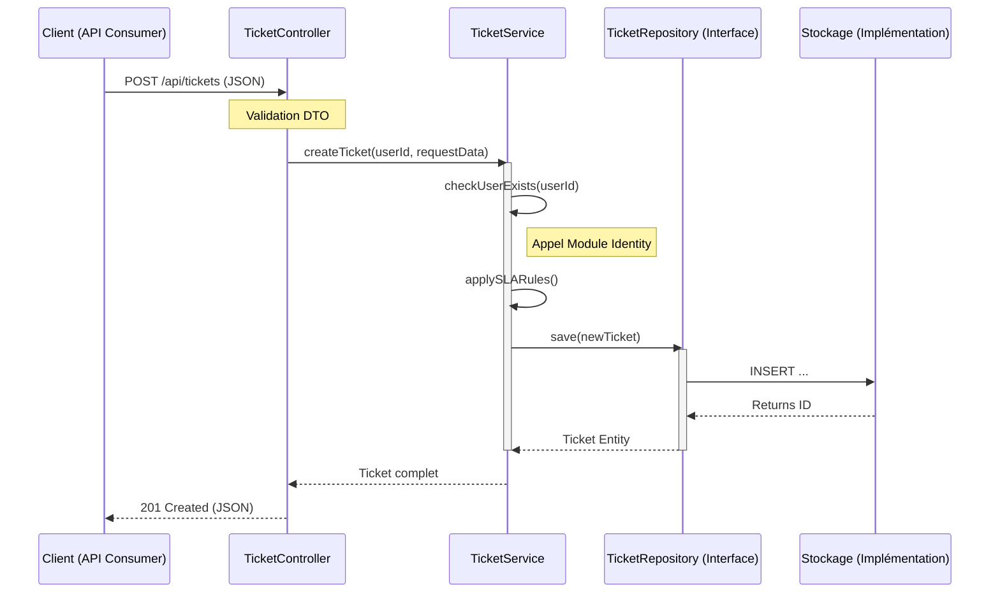
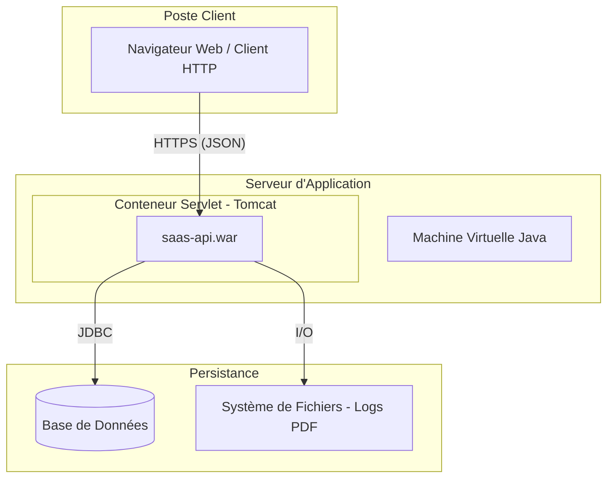

# PROJET FIL ROUGE - ARCHITECTURE LOGICIELLE
## Plateforme SaaS de Gestion de Services B2B

**Document :** Livrable Séance 2 - Modèle d'Architecture 4+1 Vues
**Rôle :** Architecte Logiciel Junior
**Date :** Séance 2
**Version :** 1.0.0

---

## 1. Vue Logique (Logical View)
**Objectif :** Décrire la structuration interne du logiciel en couches et les concepts métiers (MCD).

### 1.1. Architecture en Couches (Layered Architecture)
Pour garantir la maintenabilité et la séparation des responsabilités, l'application respecte une architecture en 3 couches strictes :

1.  **Couche Présentation (API/Controller) :**
    * Point d'entrée de l'application (Exposition REST).
    * Responsabilité : Validation des entrées, conversion JSON <-> DTO, déléguation au métier.
    * *Interdiction :* Aucune règle métier ici.

2.  **Couche Métier (Service/Domain) :**
    * Cœur du système.
    * Responsabilité : Règles de gestion, calculs, orchestration.
    * *Isolation :* Ne connaît pas la technologie de base de données (utilise des interfaces).

3.  **Couche de Persistence (Data Access) :**
    * Responsabilité : Stockage et récupération des données.
    * *Abstraction :* Masquée par le pattern **Repository/DAO**.

### 1.2. Modèle Conceptuel de Données (MCD Simplifié)
Ce diagramme illustre les entités principales définies dans les modules et leurs relations.

```mermaid
classDiagram
    direction TB
    %% Relations
    Company "1" -- "*" User : emploie
    Company "1" -- "*" Subscription : souscrit
    User "1" -- "*" Ticket : crée (Auteur)
    User "1" -- "*" Ticket : traite (Agent)
    Ticket "1" -- "*" Comment : contient
    Subscription "1" -- "*" Invoice : génère

    %% Entités du Module Identity
    class Company {
        +String siret
        +String name
        +String address
    }
    class User {
        +String email
        +String passwordHash
        +Enum role
    }

    %% Entités du Module Ticketing
    class Ticket {
        +String reference
        +String title
        +String description
        +Enum status
        +Enum priority
    }
    class Comment {
        +String content
        +Date createdAt
    }

    %% Entités du Module Billing
    class Subscription {
        +Date startDate
        +Date endDate
        +Enum planType
    }
    class Invoice {
        +String number
        +Float totalAmount
        +Date issuedAt
    }
````

-----

## 2\. Vue de Développement (Development View)

**Objectif :** Décrire l'organisation statique du code source et la gestion des dépendances (Architecture Modulaire).

### 2.1. Structure Maven Multi-modules

Le projet est un "monolithe modulaire". Chaque domaine métier est isolé physiquement dans un module Maven (`jar`) distinct pour empêcher le couplage fort.

```text
saas-platform-root (pom.xml parent)
│   Build global, gestion des versions
│
├── saas-kernel (Module Commun - Shared Kernel)
│   ├── Utils, Exceptions, Interfaces DTO de base
│   └── ⚠️ Aucune dépendance vers les autres modules
│
├── saas-identity (Module Utilisateurs)
│   ├── Dépend de : saas-kernel
│   └── Services User/Company, Auth
│
├── saas-ticketing (Module Support)
│   ├── Dépend de : saas-identity, saas-kernel
│   └── Logique de tickets, SLA
│
├── saas-billing (Module Facturation)
│   ├── Dépend de : saas-identity, saas-kernel
│   └── Moteur de facturation, Abonnements
│
├── saas-reporting (Module Analytics)
│   ├── Dépend de : saas-ticketing, saas-billing, saas-kernel
│   └── Agrégation de données (Lecture seule)
│
└── saas-api (Module de Démarrage / Boot)
    ├── Dépend de : TOUS les modules ci-dessus
    └── Rôle : Assemblage, Configuration, Contrôleurs REST
```

-----

## 3\. Vue des Processus (Process View)

**Objectif :** Illustrer le comportement dynamique du système et les interactions entre les couches lors de l'exécution.

### 3.1. Scénario critique : Création d'un Ticket

Ce diagramme de séquence démontre l'absence de couplage entre la couche Présentation et la couche de Données.



-----

## 4\. Vue de Déploiement (Deployment View)

**Objectif :** Présenter l'infrastructure physique nécessaire au fonctionnement de l'application.

Bien que le projet soit académique, l'architecture est conçue pour être déployée comme suit :



-----

## 5\. Justification des Choix Architecturaux

### 5.1. Pourquoi une structure Maven Multi-modules ?

  * **Contrainte d'Industrialisation :** Cela permet de compiler et tester les modules indépendamment. Si le module `Reporting` est cassé, cela n'empêche pas de compiler le module `Identity`.
  * **Contrôle des dépendances :** C'est le seul moyen technique strict d'empêcher les dépendances cycliques (Cycle barrier). Un développeur ne peut pas utiliser une classe de `Billing` dans `Identity` si Maven n'a pas la dépendance déclarée.

### 5.2. Pourquoi l'abstraction de la Persistence (Repository) ?

  * **Réponse à la contrainte n°3 :** L'énoncé impose que le stockage soit abstrait.
  * **Testabilité :** En utilisant des interfaces pour les DAO/Repositories, nous pourrons injecter des "Mock Repositories" lors des tests unitaires, permettant de valider les règles métiers sans avoir besoin d'une base de données active.

### 5.3. Positionnement du "Noyau Commun" (Kernel)

  * **DRY (Don't Repeat Yourself) :** Ce module centralise les exceptions (`FunctionalException`) et les utilitaires dates/chaînes utilisés partout, évitant la duplication de code technique.

