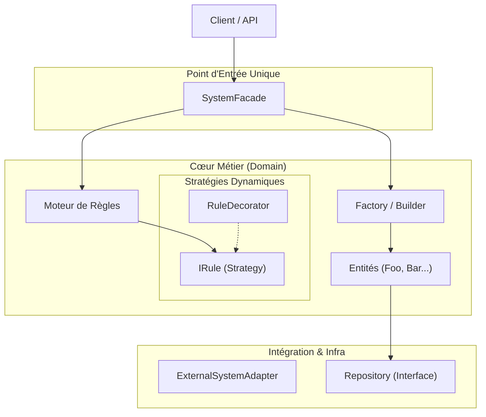

# DOSSIER FINAL D'ARCHITECTURE LOGICIELLE
## Synthèse du Projet Fil Rouge

**Version :** 1.0 (Livrable Séance 10)

---

## 1. Contexte et Objectifs

### 1.1. Présentation du Projet
Ce projet consiste en la conception et l'architecture d'une plateforme **SaaS B2B** modulaire. L'application doit gérer des domaines métiers distincts mais interconnectés (Identité, Facturation, Support Ticketing, Reporting) tout en restant évolutive et maintenable.

### 1.2. Problématique Initiale
Le défi principal était d'éviter le "Monolithe Spaghetti" (code fortement couplé) sans tomber prématurément dans la complexité excessive des Micro-services. Le système devait :
*   Isoler les responsabilités métiers.
*   Être testable indépendamment de l'infrastructure (Base de données, API externes).
*   Permettre une évolution dynamique des règles métiers sans refonte structurelle.

---

## 2. Structuration Progressive (Séances 1 à 7)

### 2.1. Le Choix Architectural : Monolithe Modulaire
Nous avons opté pour une **Architecture en Couches (Layered Architecture)** organisée en **Modules Maven distincts**.

*   **Pourquoi pas des Micro-services ?** L'équipe et l'infrastructure ne justifiaient pas la complexité réseau/déploiement.
*   **Pourquoi pas un Monolithe simple ?** Risque trop élevé de couplage fort entre des domaines qui ne devraient pas se connaitre (ex: Le Ticketing ne doit pas modifier la Facturation).

### 2.2. Découpage Modulaire (S4 & S7)
L'application a été découpée physiquement pour contraindre les dépendances :
1.  **`saas-kernel`** : Socle technique partagé (Exceptions, Utils). Ne dépend de rien.
2.  **`saas-identity`** : Gestion des utilisateurs (Autorité centrale).
3.  **`saas-ticketing` / `saas-billing`** : Modules métiers cœurs.
4.  **`saas-api`** : Couche de présentation et d'assemblage.

Ce découpage garantit que le code métier est protégé des détails d'infrastructure.

### 2.3. Abstraction de la Persistance (S5)
Pour rendre le métier testable, nous avons appliqué le pattern **Repository**.
*   **Décision :** Le métier définit des interfaces (`IRepository`). L'infrastructure implémente ces interfaces.
*   **Gain :** Nous avons pu développer et tester le métier avec des mocks en mémoire (`InMemoryRepository`) sans attendre la base de données SQL.

### 2.4. Centralisation de l'Instanciation (S6)
L'utilisation directe de `new` dans le code métier créait un couplage fort.
*   **Solution :** Mise en place d'une **Factory (Singleton)** et d'un **Builder**.
*   **Gain :** La logique de création d'objets complexes (graphes de dépendances) est centralisée. Le métier demande une instance, la Factory décide comment la construire.

---

## 3. Simplification de l'Accès (Séance 8)

### 3.1. Le Problème
Avec l'introduction de la Factory, du Builder et des différents modules, l'initialisation du système est devenue verbeuse pour le client final (la couche API ou un système tiers). Le client devait connaître trop de détails techniques d'assemblage.

### 3.2. La Solution : Pattern Facade
Nous avons introduit une **Facade** (`SystemFacade`) qui agit comme un "cockpit" simplifié.

*   **Rôle :** Elle orchestre les appels à la Factory, au Builder et aux services sous-jacents.
*   **Bénéfice :** Le client appelle une méthode simple `createUnifiedSystem()`. La complexité interne est masquée. La Facade garantit l'utilisation correcte des briques élémentaires.

### 3.3. Ouverture : Pattern Adapter
Pour permettre l'intégration avec des écosystèmes tiers imposant leurs propres interfaces, nous avons ajouté un **Adapter**. Il traduit les appels externes en commandes compréhensibles par notre domaine interne, sans polluer ce dernier.

---

## 4. Dynamisme et Évolutivité (Séance 9)

Une fois la structure stabilisée, le besoin de flexibilité fonctionnelle est apparu. Comment gérer des règles métiers changeantes (ex: calcul de scores, promotions, règles de validation) sans modifier le code source des entités ?

### 4.1. Pattern Strategy (Le Moteur de Règles)
Nous avons extrait les algorithmes de calcul des entités pour les placer dans des classes dédiées implémentant une interface commune (`IRule`).
*   **Avant :** Des `if/else` complexes dans la classe métier.
*   **Après :** Une liste de stratégies injectables (`RuleEngine`).
*   **Gain :** On peut ajouter, retirer ou modifier une règle métier à chaud en changeant simplement l'implémentation injectée.

### 4.2. Pattern Decorator (L'Enrichissement)
Pour combiner des comportements (ex: "Appliquer la règle A" ET "Doubler le résultat"), l'héritage classique aurait mené à une explosion de classes.
*   **Solution :** Le Decorator enveloppe une règle existante pour en modifier le résultat.
*   **Gain :** Une infinité de combinaisons possibles à partir de briques simples, sans toucher au code des règles de base.

---

## 5. Architecture Finale Consolidée

L'architecture résultante est un système robuste, où chaque changement technique ou fonctionnel a sa place dédiée.

### Schéma Logique Global

### Conclusion
Nous sommes partis d'un besoin fonctionnel flou pour arriver à une architecture industrielle :
1.  **Structurelle** (Modules, Layered) pour la maintenance.
2.  **Créationnelle** (Factory, Builder) pour le découplage.
3.  **Structurelle** (Facade, Adapter) pour l'utilisabilité.
4.  **Comportementale** (Strategy, Decorator) pour l'évolution métier.

Le système est désormais prêt pour l'industrialisation, capable d'absorber de nouvelles règles métiers ou de changer de système de persistance avec un impact minimal sur le code existant.
