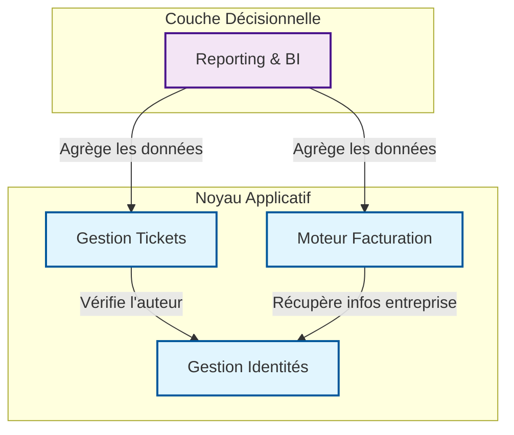
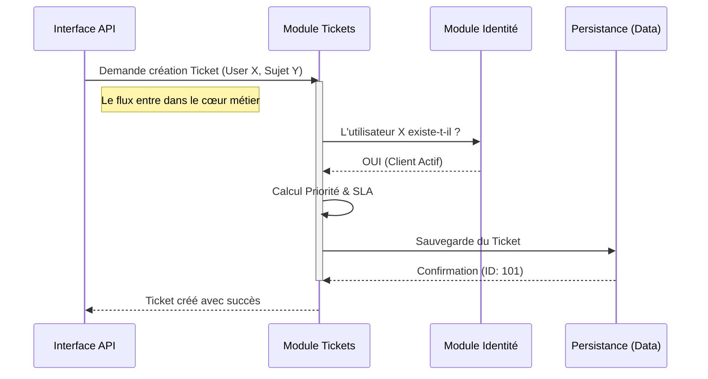
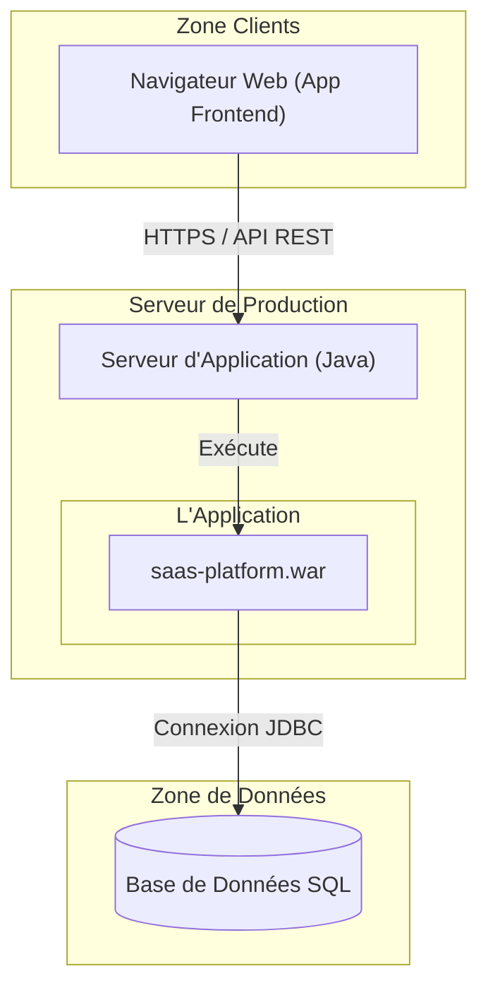

# LIVRABLE SÉANCE 2 : Architecture 4+1 Vues (Révisé)

*Changements majeurs ici : La Vue Logique ne parle plus de "Controller" ou de "Maven", mais de blocs fonctionnels. La distinction entre Logique et Développement est maintenant nette.*

## 1. Vue Logique (Logical View)

**Question :** *Quels sont les grands blocs fonctionnels et comment communiquent-ils ?*

Cette vue fait abstraction de la technique (Java, SQL). Elle montre l'organisation des responsabilités.

### 1.1. Diagramme de Composants Métiers

Le système est structuré autour de composants autonomes qui exposent des interfaces claires.



### 1.2. Modèle Conceptuel (Entités Clés)

* **Identity :** `User`, `Company`, `Role`
* **Ticketing :** `Ticket`, `Message`, `Category`
* **Billing :** `Subscription`, `Invoice`, `Plan`
* **Reporting :** `Dashboard`, `KpiMetric`

---

## 2. Vue de Développement (Development View)

**Question :** *Comment le code est-il organisé pour les développeurs ?*

Cette vue traduit la vue logique en contraintes de construction logicielle. Nous utilisons une **structure modulaire stricte** (Maven Multi-modules) pour empêcher physiquement les violations d'architecture (ex: le ticket ne doit pas modifier une facture).

```text
PROJET RACINE (Root)
│
├── module-kernel (Le socle technique)
│   Usage : Utilisé par tous les autres modules.
│   Contient : Utilitaires, Exceptions, DTOs de base.
│
├── module-identity (Implémentation du domaine Identité)
│   Dépend de : module-kernel
│
├── module-ticketing (Implémentation du domaine Support)
│   Dépend de : module-kernel, module-identity (dépendance déclarée)
│
├── module-billing (Implémentation du domaine Facturation)
│   Dépend de : module-kernel, module-identity
│
├── module-reporting (Implémentation du domaine Pilotage)
│   Dépend de : module-kernel, module-ticketing, module-billing
│
└── module-api (Point d'entrée / Assemblage)
    Rôle : Contient la configuration de démarrage et l'exposition REST.
    Dépend de : TOUS les modules ci-dessus.

```

---

## 3. Vue des Processus (Process View)

**Question :** *Que se passe-t-il dans le système lors d'une action clé ?*

Scénario : **Un utilisateur crée un ticket de support.**
Ce diagramme montre la collaboration entre les blocs identifiés dans la vue logique.

*Note : On observe ici que le module "Ticket" ne sauvegarde pas aveuglément. Il orchestre des vérifications.*



---

## 4. Vue de Déploiement (Deployment View)

**Question :** *Où et comment l'application est-elle installée ?*

L'application est monolithique au déploiement (un seul artefact) mais modulaire à la conception.



---

## 5. Synthèse & Justifications

*(Réponse aux critiques : "Pourquoi on fait ça ?")*

1. **Pourquoi séparer la Vue Logique de la Vue Développement ?**
* La *Vue Logique* nous permet de discuter avec le métier des responsabilités (Qui gère les utilisateurs ?).
* La *Vue Développement* nous permet de contraindre les développeurs (Interdire d'importer le package Billing dans Identity).


2. **Pourquoi ce découpage en modules ?**
* Pour respecter le principe de **Faible Couplage**. Si le module Reporting contient un bug, il ne doit pas empêcher la création de tickets ou la facturation.


3. **Gestion de la complexité :**
* En isolant le "Noyau Partagé" (Kernel), on évite de dupliquer du code technique, tout en laissant les modules métiers se concentrer uniquement sur leurs règles business.