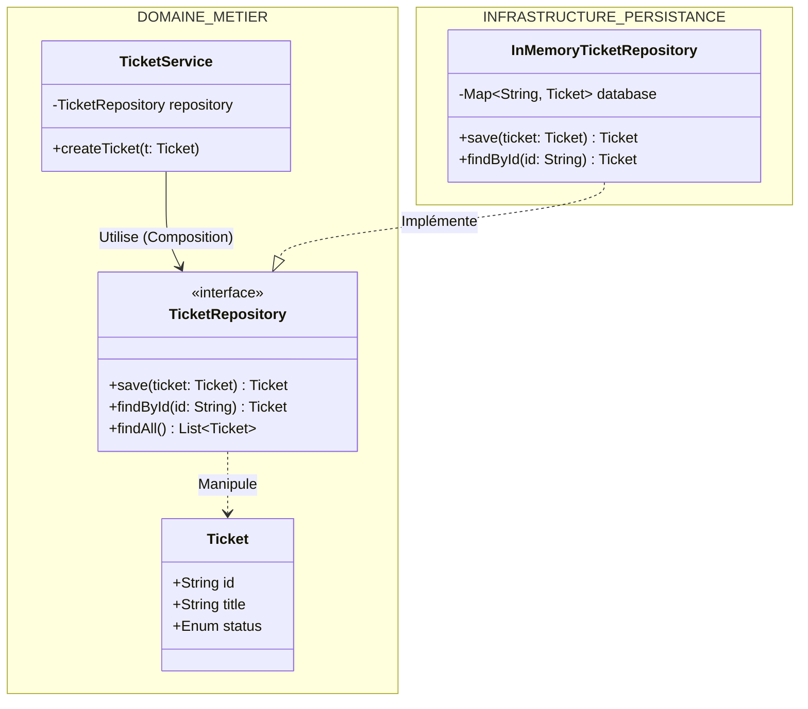

# LIVRABLE SÉANCE 5 : Couche de Persistence Abstraite

**Document :** Conception et Simulation de la Persistence
**Rôle :** Architecte Logiciel
**Objectif :** Protéger le métier des contraintes techniques de stockage.

## 1. Concept Architectural : Le Pattern Repository

Nous refusons que nos Services Métiers (ex: `TicketService`) contiennent du code SQL ou dépendent d'une librairie technique (JPA/Hibernate) directement.

Nous appliquons donc une **séparation stricte** :

1. **L'Interface (Le Contrat) :** Elle appartient au Métier. Elle définit *ce dont* le métier a besoin (ex: "Trouve-moi un ticket par son ID").
2. **L'Implémentation (L'Exécutant) :** Elle appartient à l'Infrastructure. Elle définit *comment* on le fait (ex: "Je vais chercher dans une HashMap en mémoire").

### Diagramme de Classes (Vue Logique)

Ce diagramme montre que le `TicketService` ne dépend que de l'interface. Il ne "voit" pas l'implémentation en mémoire.



---

## 2. Implémentation : La Couche Abstraite (Code Java)

Voici comment cela se traduit concrètement dans le code (exemple sur le module `saas-ticketing`).

### A. L'Entité Métier (Pancarte "Ne pas toucher")

C'est un objet pur Java (POJO). Aucune annotation `@Entity` ou `@Table` (pour l'instant), car cela polluerait le métier avec de la technique.

```java
package com.saas.ticketing.domain.model;

public class Ticket {
    private String id;
    private String title;
    private String status; // "OPEN", "CLOSED"

    // Constructeurs, Getters, Setters
    public Ticket(String id, String title) {
        this.id = id;
        this.title = title;
        this.status = "OPEN";
    }
    // ...
}

```

### B. L'Interface Repository (Le Contrat)

C'est la porte d'entrée unique vers les données. Elle est située dans le package du domaine (`com.saas.ticketing.domain.repository`).

```java
package com.saas.ticketing.domain.repository;

import com.saas.ticketing.domain.model.Ticket;
import java.util.List;
import java.util.Optional;

public interface TicketRepository {
    // Le contrat est clair : on parle en objets "Ticket", pas en ResultSet SQL
    Ticket save(Ticket ticket);
    Optional<Ticket> findById(String id);
    List<Ticket> findAllByStatus(String status);
}

```

---

## 3. Simulation du Stockage (Mock en Mémoire)

Pour respecter la contrainte n°3 ("La technologie de stockage doit pouvoir être remplacée") et permettre le développement immédiat sans base de données réelle, nous créons une implémentation `InMemory`.

C'est une classe technique qui simule une base de données avec une `HashMap`.

```java
package com.saas.ticketing.infrastructure.persistence;

import com.saas.ticketing.domain.model.Ticket;
import com.saas.ticketing.domain.repository.TicketRepository;
import java.util.ArrayList;
import java.util.HashMap;
import java.util.List;
import java.util.Map;
import java.util.Optional;
import java.util.stream.Collectors;

// Cette classe SIMULE une base de données MySQL
public class InMemoryTicketRepository implements TicketRepository {

    // Notre "Base de données" est une simple Map en mémoire RAM
    private final Map<String, Ticket> database = new HashMap<>();

    @Override
    public Ticket save(Ticket ticket) {
        System.out.println("[DB-SIMULATION] Insert into TICKETS values " + ticket.getId());
        database.put(ticket.getId(), ticket);
        return ticket;
    }

    @Override
    public Optional<Ticket> findById(String id) {
        System.out.println("[DB-SIMULATION] Select * from TICKETS where id=" + id);
        return Optional.ofNullable(database.get(id));
    }

    @Override
    public List<Ticket> findAllByStatus(String status) {
        return database.values().stream()
                .filter(t -> t.getStatus().equals(status))
                .collect(Collectors.toList());
    }
}

```

---

## 4. Utilisation dans le Service Métier

La preuve du découplage : le Service ne fait jamais `new InMemoryTicketRepository()`. Il reçoit l'interface via son constructeur (Injection de Dépendance).

```java
package com.saas.ticketing.domain.service;

public class TicketService {
    
    // Dépendance vers l'INTERFACE, pas la classe
    private final TicketRepository ticketRepository;

    // Injection de dépendance (via Constructeur)
    public TicketService(TicketRepository ticketRepository) {
        this.ticketRepository = ticketRepository;
    }

    public void createTicket(String title) {
        // Logique métier pure
        Ticket newTicket = new Ticket(java.util.UUID.randomUUID().toString(), title);
        
        // Appel agnostique au stockage
        ticketRepository.save(newTicket);
    }
}

```

## 5. Synthèse & Avantages pour le projet

1. **Indépendance :** Si demain nous passons à PostgreSQL ou MongoDB, nous créons une classe `JdbcTicketRepository` qui implémente la même interface. **Le code du `TicketService` ne changera pas d'une virgule.**
2. **Testabilité :** Nous pouvons tester le métier dès maintenant, sans installer de serveur de base de données.
3. **Vitesse :** Les tests unitaires s'exécutent en millisecondes car tout est en mémoire.
